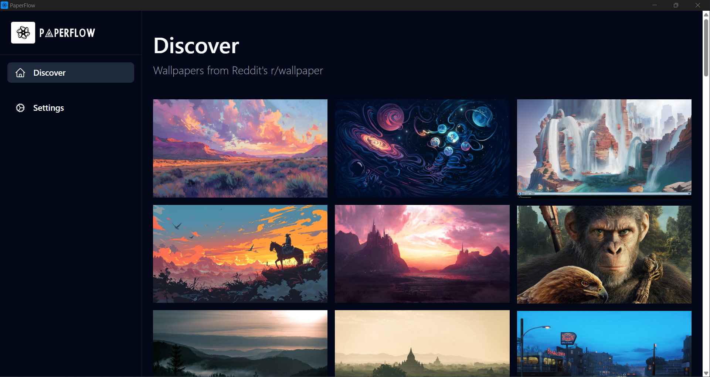
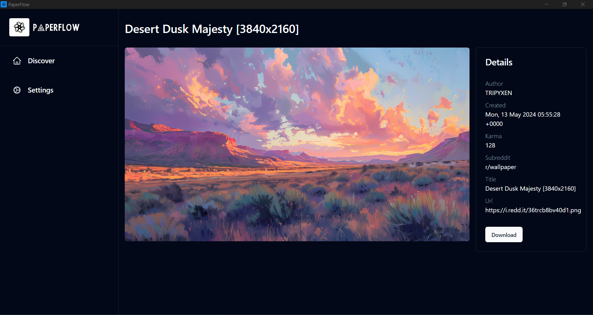
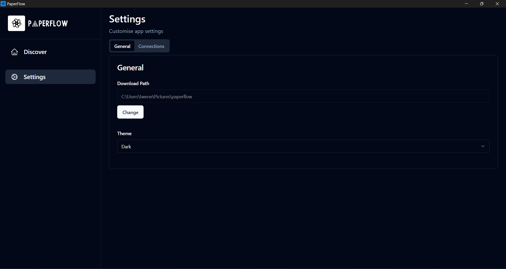
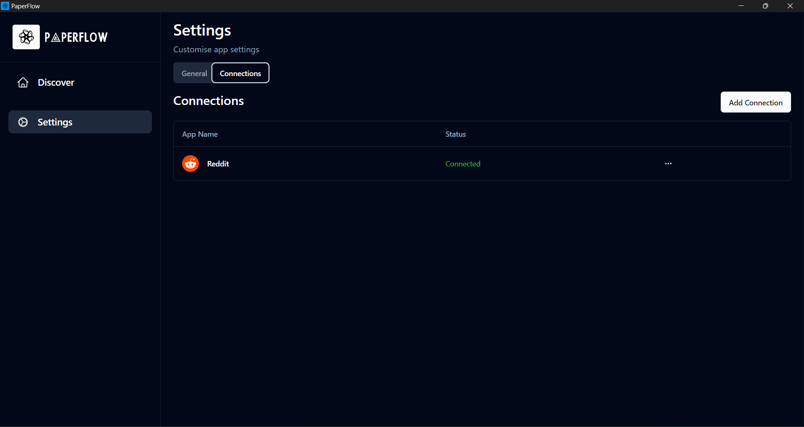

    

**A Cross Platform Desktop app made to discover and download beautiful wallpapers sourced from Reddit.**

Currently in development in the [develop](https://github.com/briantwene/paperflow/tree/develop) branch 🛠️

## Features ✨

- A preview screen to set your wallpaper
- Fullscreen mode
- Explore a collection of stunning wallpapers from Reddit.
- Download and set high-quality wallpapers to personalize your desktop
- Cross platform

## Screenshots 📷

## Installation ⏬

You can download the latest version of the app from the [releases page](https://github.com/briantwene/paperflow/releases) of this repository.

After navigating to the releases page, select the latest release and download the appropriate file for your operating system:

- For Windows, download the `.exe` file.
- For Mac, download the `.dmg` file.
- For Linux, download the `.AppImage` file.

After downloading the executable, you can install the app by double-clicking on the downloaded file and following the on-screen instructions.

## Roadmap 🛣️

- [ ] Add more Desktop wallpaper subreddits

- [ ] Add more sources such as wallhaven.cc

- [ ] Set a Random wallpaper everyday 

- [ ] Mark images as favorite for later

Currently Brainstorming more 🧠

## Tech Stack 💻
The app is powered by [Tuari](https://github.com/tauri-apps/tauri) which is a toolkit that allows you to use web tech on the frontend powered by Rust.

**Frontend:** React, TailwindCSS, Tanstack Router

**Backend:** Using Tauri's Rust Core as a backend to deal with image fetching and any desktop related stuff.

